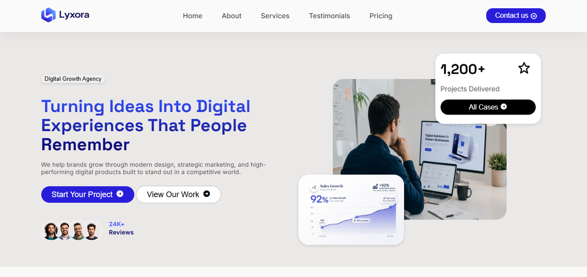

# 🚀 Lyxora Digital Growth Agency Landing Page

A modern, responsive landing page for Lyxora, a digital growth agency focused on web design, digital marketing, product development, and analytics.

## 🌐 Live Demo

👉 [View Live Website](https://mzwandilem.github.io/Landing-page/)

## 📸 Preview



## 📋 About The Project

This project is a responsive agency landing page built from scratch using HTML, CSS, and JavaScript.

The goal was to practice building a complete professional website while strengthening my frontend development skills.

The landing page includes:

- Responsive navigation
- Hero section
- Services section
- Process section
- Testimonials
- Pricing plans
- Call-to-action section
- Newsletter section
- Footer
- Responsive layouts
- Hover effects
- CSS transitions
- Mobile navigation

## 🛠️ Built With


## ✨ Features

### 📱 Responsive Navigation

The navigation transforms into a mobile menu on smaller screens.

Users can:

- Open the mobile navigation
- Close the navigation
- Select navigation links
- Automatically close the menu after selecting a link

### 🎯 Hero Section

The hero section introduces the Lyxora brand with:

- Agency badge
- Main headline
- Description
- Call-to-action buttons
- Customer review statistics
- Customer avatars
- Project statistics
- Performance card

### 💼 Services

The services section presents four core services:

- Brand & Web Design
- Digital Marketing
- Product Development
- Analytics & Strategy

Each service card includes hover interactions and an Explore button.

### ⚙️ Process

The process section explains the workflow:

1. Understanding Goals
2. Customized Strategy
3. Designing & Building
4. Launch & Growth

### 💬 Testimonials

The testimonials section displays client feedback using responsive testimonial cards.

### 💳 Pricing

The pricing section includes three plans:

- Starter
- Growth
- Enterprise

Each plan contains its own features and call-to-action button.

### 🚀 Call To Action

A dedicated CTA section encourages visitors to start a project or book a free call.

### 🔗 Footer

The footer contains:

- Company information
- Newsletter signup
- Social media links
- Company navigation
- Resources
- Help
- Legal links
- Copyright information

## 📐 Responsive Design

The website is designed to work across different screen sizes.

| Device | Breakpoint |
|---|---|
| 📱 Mobile | `< 576px` |
| 📱 Tablet | `576px - 991px` |
| 💻 Laptop | `992px - 1199px` |
| 🖥️ Desktop | `1200px - 1399px` |
| 🖥️ Large Screens | `1400px+` |

The layout adapts using:

- Flexbox
- CSS Grid
- Media Queries
- Responsive sizing
- Mobile-first adjustments

## 🧠 What I Practiced

This project helped me practice:

- Semantic HTML
- CSS layout
- Flexbox
- CSS Grid
- Responsive design
- Media queries
- Positioning
- CSS transitions
- Hover effects
- CSS animations
- DOM selection
- JavaScript event listeners
- Git
- GitHub
- GitHub Pages

## 📁 Project Structure

```text
landing-page/
│
├── assets/
│   └── images/
│       ├── avatar1.png
│       ├── avatar2.png
│       ├── avatar3.png
│       ├── avatar4.png
│       ├── chart.png
│       ├── cta.png
│       ├── hero_img.png
│       ├── howitworks.png
│       ├── logo_img.png
│       └── preview-hero.png
│
├── index.html
├── style.css
├── script.js
└── README.md
